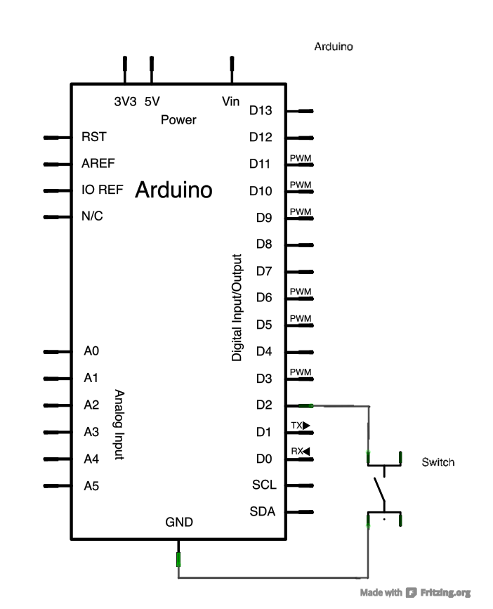
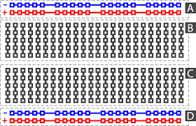

# Intro To Arduino Workshop

## Why Arduino?

* Direct access to hardware devies
* No Operating System
    * Less abstraction, but better timing consistency
    * Great for working with things like proprietary serial connections that require very specific timing
* Some examples of things that can be done (and have been done in BUILDS):
    * Gamecube controller modifications
    * Roomba Hack
* The Arduino specification is open-source
    * Tons of versions of Arduino-compatible hardware for varied purposes
        * Nanos for small projects, UNOs for general purpose, Megas for programs that require more power/ROM, LilyPad Arduinos for wearable projects, etc.
    * You can even make your own Arduino-compatible system out of the individual components!

## Basics of Arduino Hardware


The arduino has pins to interface with:
* Digital pins 0-13: Either at a high or low state (5V or 0V)
* Analog pins A0-A5: Can take any voltage between 0 and 5V

Some other non-general purpose pins: Pins for programmer, reset pins, power pins, etc.

## Getting Started With the Arduino IDE

First download the Arduino IDE: https://www.arduino.cc/en/Main/Software

You can write your programs in the 
IDE, then upload them to your arduino device to run whenever the Arduino powered on.

The Arduino environment uses the following two functions to manage execution on the device:

* setup(): Runs a single time, upon the device being powered on.

* loop(): Runs repeatedly after setup() has run, and until the device powers off.

Some useful functions in the Arduino environment include:

* pinMode(int pin, OUTPUT); //set up a pin to be used for output
* pinMode(int pin, INPUT); //set up a pin to be used for input -- Used to read the voltage on the pin as either HIGH or LOW
* pinMode(int pin, INPUT_PULLUP); //set up a pin to be read HIGH when it has a closed circuit, and LOW when it has an open circuit



* digitalWrite(int pin, HIGH); //Write HIGH to a pin(set its voltage to 5V)
* digitalWrite(int pin, LOW); //Write LOW to a pin(set its voltage to 0V)

* int val = digitalRead(int pin); //Read a pin to see if it's HIGH or LOW

* analogRead/analogWrite can be used on the analog pins to get the voltage level (not just HIGH or LOW). Uses values between 0 and 1023 for voltages between 0V and 5V

* delay(unsigned long ms) //pauses execution for the specified number of milliseconds

* Serial.print(message) //prints a message to the serial console (view from Tools->Serial Monitor)
* Serial.read() //reads a message from the serial console (view from Tools->Serial Monitor)

## Making Circuits for Arduino

### How breadboards work:


Each connected part in the diagram is connected inside of the breadboard.

### Wiring to an Arduino
Lets make a simple circuit that will power an LED using the output of a pin on the Arduino to power it.

# Writing the Code

Now we'll write some simple code to blink the LED on and off each second.

We need to set up a pin as output, hook that pin up to a circuit to power an LED, and switch the pin from HIGH to LOW and LOW to HIGH each second.

```arduino
int pin = 2;

void setup() {
    // put your setup code here, to run once:
    pinMode(pin, OUTPUT);
}

void loop() {
    // put your main code here, to run repeatedly:
    digitalWrite(pin, HIGH);
    delay(1000);
    digitalWrite(pin, LOW);
    delay(1000);
}
```

To upload the sketch:
* Go to Tools->Board->Choose the device you're using
* Go to Tools->Port->Choose your port (There's probably only one)
* Click the upload button

You can also use programmers other than the on-board one (you can buy a programmer, or even use another arduino or raspberry pi as a programmer for devices that don't have one built-in)

# What Can I Do From Here?

You can do similar stuff to control anything that you can power with the Arduino, or control anything that can take digital inputs.

You can also interface with things that send outputs, by reading from pins on the Arduino instead of writing to pins.

There's plenty of existing hardware that can be interfaced with relatively easily just by using an Arduino!

A lot of this info is also useful for similar devices like Raspberry Pi's (most similar devices also let you read/write to/from specific pins).

